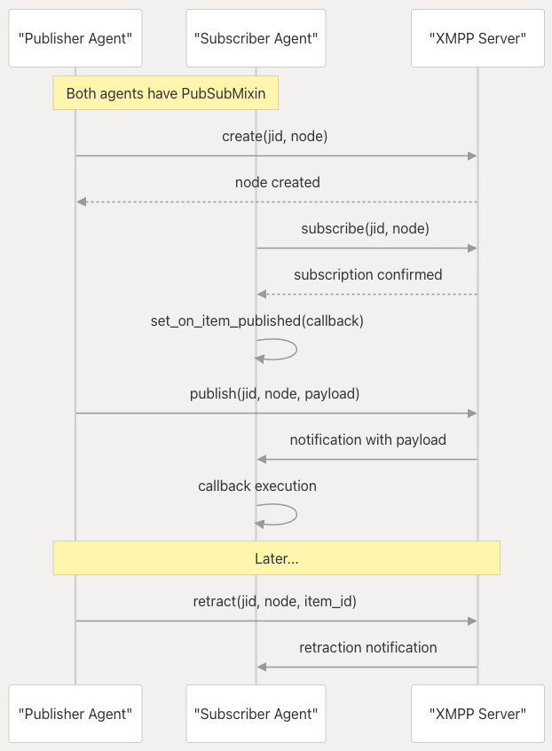
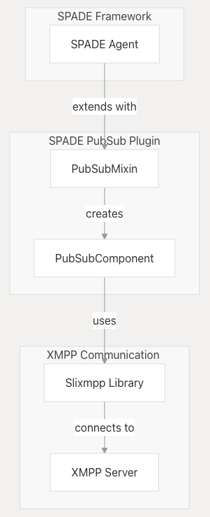
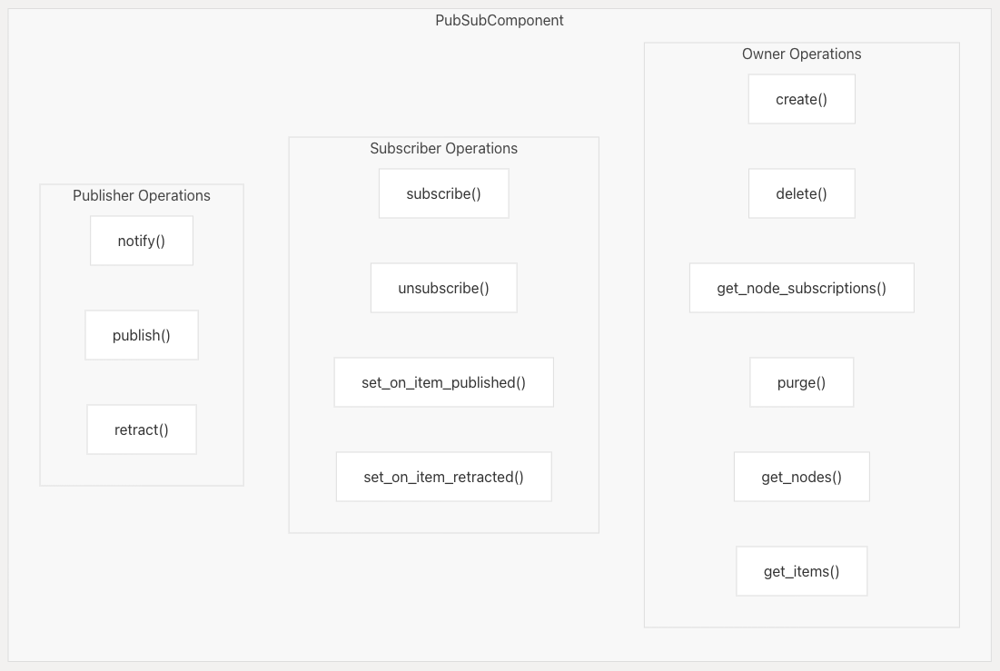
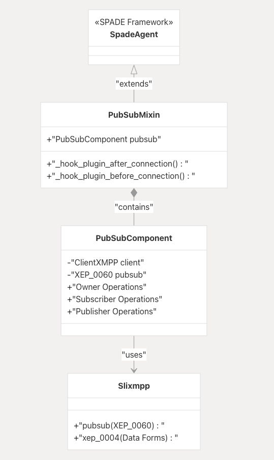
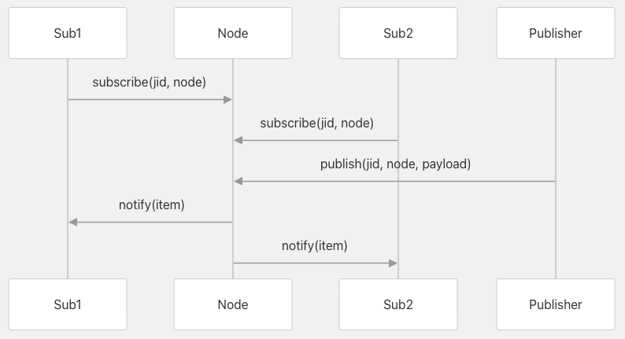
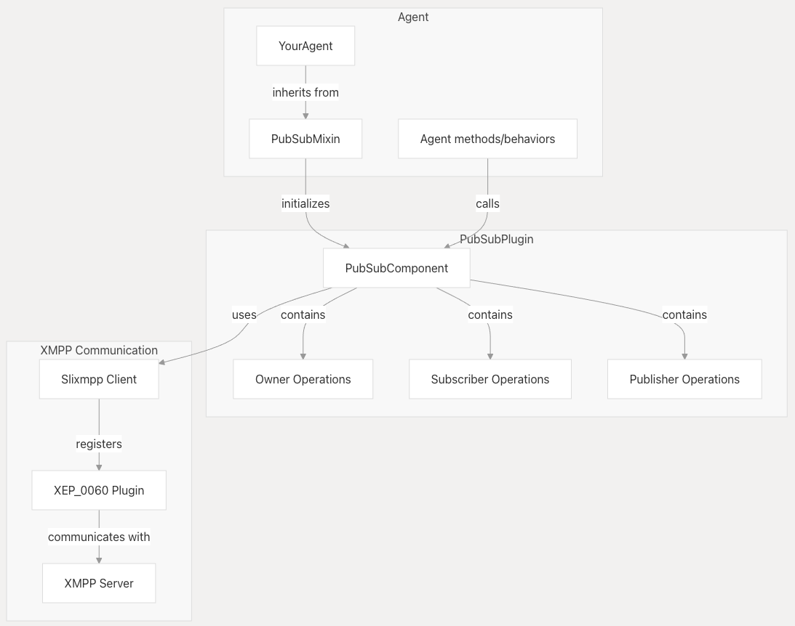

=====
Usage
=====

SPADE PubSub is a plugin that extends the SPADE (Smart Python Agent Development Environment) framework with publish-subscribe 
communication capabilities. It enables SPADE agents to leverage the XMPP PubSub extension for efficient, decoupled communication patterns in multi-agent systems.

PubSub Workflow
----------------
The following diagram illustrates the typical workflow of PubSub operations in the system:

Architecture
============

System Purpose and Context
--------------------------
The SPADE PubSub system extends the SPADE (Smart Python Agent Development Environment) framework with publish-subscribe capabilities, 
allowing agents to communicate through a decentralized message distribution pattern. This architecture leverages the XMPP protocol for 
implementing the PubSub pattern, which provides a robust solution for asynchronous, many-to-many communications between agents.

Architectural Components
------------------------

The architecture consists of three main layers:

1. **Agent Layer**: SPADE agents that use the PubSub functionality
2. **PubSub Layer**: The PubSubMixin and PubSubComponent classes that implement the PubSub pattern
3. **Communication Layer**: Slixmpp library and XMPP server that handle the actual message transport

Role-Based Design
-----------------

The PubSub architecture follows a role-based design pattern, where operations are organized by the role a participant plays in the 
PubSub system:

* **Owner**: Operations for creating, deleting, and managing nodes
* **Subscriber**: Operations for subscribing to nodes and receiving notifications
* **Publisher**: Operations for publishing items to nodes and retracting them

This design makes the API intuitive to use and aligns with the XMPP PubSub specification (XEP-0060).

Core Components
===============

This document provides a detailed explanation of the main components that form the core of the SPADE PubSub system: `PubSubMixin` and 
`PubSubComponent`. These components enable publish-subscribe capabilities for SPADE agents using the XMPP protocol.

The SPADE PubSub system is built around two primary components that work together to provide publish-subscribe functionality:

PubSubMixin
-----------

`PubSubMixin` is a class designed to be inherited by SPADE agents to gain publish-subscribe capabilities. It follows the mixin pattern, 
which allows functionality to be added to existing classes without modifying their source code.

The mixin's primary responsibility is to:

1. Initialize the `PubSubComponent` when an agent connects to the XMPP server
2. Provide the agent with access to all publish-subscribe operations through the `pubsub` attribute

PubSubComponent
---------------
`PubSubComponent` is an inner class of `PubSubMixin` that implements the actual publish-subscribe functionality. 
It serves as a bridge between the SPADE agent and the Slixmpp library's publish-subscribe capabilities.

When initialized, `PubSubComponent`:

* Stores a reference to the Slixmpp client
* Registers the XEP-0060 (Publish-Subscribe) plugin
* Registers the XEP-0004 (Data Forms) plugin
* Sets up access to the Slixmpp pubsub interface

The component's methods are organized into three functional categories based on the roles in a publish-subscribe system:

**Owner Operations**. Methods for managing pubsub nodes:
    
+---------------------------------------------------+------------------------------------------+
| Method                                            | Description                              |
+===================================================+==========================================+
| `create(target_jid, target_node, config_form)`    | Creates a new pubsub node                |
+---------------------------------------------------+------------------------------------------+
| `delete(target_jid, target_node)`                 | Deletes an existing node                 |
+---------------------------------------------------+------------------------------------------+
| `get_node_subscriptions(target_jid, target_node)` | Gets a list of subscriptions to a node   |
+---------------------------------------------------+------------------------------------------+
| `purge(target_jid, target_node)`                  | Deletes all items from a node            |
+---------------------------------------------------+------------------------------------------+
| `get_nodes(target_jid, target_node)`              | Gets a list of nodes at a service        |
+---------------------------------------------------+------------------------------------------+
| `get_items(target_jid, target_node)`              | Gets a list of items in a node           |
+---------------------------------------------------+------------------------------------------+

**Subscriber Operations**. Methods for subscribing to and receiving notifications from nodes:

+----------------------------------------------------------------+----------------------------------------------+
| Method                                                         | Description                                  |
+================================================================+==============================================+
| `subscribe(target_jid, target_node, subscription_jid, config)` | Subscribes to a node                         |
+----------------------------------------------------------------+----------------------------------------------+
| `unsubscribe(target_jid, target_node, subscription_jid, subid)`| Unsubscribes from a node                     |
+----------------------------------------------------------------+----------------------------------------------+
| `set_on_item_published(callback)`                              | Sets a callback for when items are published |
+----------------------------------------------------------------+----------------------------------------------+
| `set_on_item_retracted(callback)`                              | Sets a callback for when items are retracted |
+----------------------------------------------------------------+----------------------------------------------+

**Publisher Operations**. Methods for publishing content to nodes:

+------------------------------------------------------------+----------------------------------------------------+
| Method                                                     | Description                                        |
+============================================================+====================================================+
| `notify(target_jid, target_node)`                          | Notifies subscribers without publishing an item    |
+------------------------------------------------------------+----------------------------------------------------+
| `publish(target_jid, target_node, payload, item_id, ifrom)`| Publishes an item to a node                        |
+------------------------------------------------------------+----------------------------------------------------+
| `retract(target_jid, target_node, item_id, notify)`        | Retracts a previously published item               |
+------------------------------------------------------------+----------------------------------------------------+

Basic Usage
-----------

This page introduces the fundamental operations for working with the SPADE PubSub plugin. 
It covers how to set up agents with publish-subscribe capabilities, create and manage nodes, publish content, and receive notifications.

The PubSub plugin gives agents the ability to create nodes, subscribe to nodes and publish items to nodes following the
XEP 0060 (https://xmpp.org/extensions/xep-0060.html).

Setting Up an Agent with PubSubMixin
------------------------------------
To use the SPADE PubSub functionality, you need to create a SPADE agent that inherits from the PubSubMixin class. The mixin must be 
placed before the Agent class in the inheritance order.::

    from spade_pubsub import PubSubMixin
    from spade import Agent

    class PubSubAgent(PubSubMixin, Agent):
        # Your agent code here

Once your agent starts and connects to the XMPP server, the `_hook_plugin_after_connection` method automatically initializes the `pubsub` 
attribute, which provides access to all PubSub operations.

.. warning:: Mixins MUST be always placed before the Agent class in the inheritance order.

Below is a diagram illustrating the fundamental publish-subscribe pattern implemented by the SPADE PubSub system:

Working with PubSub Nodes
-------------------------

An agent can create a node where other agents may subscribe in order to receive notifications when new items are published
in such node.

.. warning:: Due to limitations of the XMPP Publish-Subscribe standard, agents MUST be registered in the XMPP server
             with creation privileges in order to create nodes. (e.g. In Prosody include them in the admin list (`admins = {}`).

.. tip:: Note that you MUST substitute PUBSUB_JID with the address of the pubsub component that your XMPP server uses (e.g. "pubsub.localhost)

To create and delete a node in a PubSub server::

    await self.agent.pubsub.create(PUBSUB_JID, "Name of the node")
    await self.agent.pubsub.delete(PUBSUB_JID, "Name of the node")

To get all nodes from a PubSub server::

    list_of_nodes = await self.agent.pubsub.get_nodes(PUBSUB_JID)

To purge all items from a node::

       await self.agent.pubsub.purge(PUBSUB_JID, "Name of the node")

Publishing Items to a node
--------------------------

Once a node is created, you can publish information to that node. That information will be received by all subscriptors of the node.

Publish an item::

        await self.agent.pubsub.publish(PUBSUB_JID, "Name of the node", "Payload of the item")

Where `payload` is the content you want to publish. This can be a string or an XML Element.

Get all published items from a node::

        items = await self.agent.pubsub.get_items(PUBSUB_JID, "Name of the node")

This returns a list of strings, where each string is the payload of an item.

Retracting Items. To remove a specific item from a node::

    await agent.pubsub.retract(target_jid, node_name, item_id, notify=True)

The notify parameter controls whether subscribers should be notified about the retraction.

Subscribing to Nodes
--------------------

Subscribe and unsubscribe::

            await self.agent.pubsub.subscribe(PUBSUB_JID, "Name of the node")
            await self.agent.pubsub.unsubscribe(PUBSUB_JID, "Name of the node")

Get all subscriptions of a node::

            list_of_subs = await self.agent.pubsub.get_node_subscriptions(PUBSUB_JID, "Name of the node")

Setting Up Callbacks
--------------------
To receive notifications when items are published, you need to set up callback functions::

    def on_item_published(jid, node, item, message=None):
        # Process the published item
        payload = item.get_payload()
        print(f"Received item from {jid}, node {node}: {payload.text}")

    agent.pubsub.set_on_item_published(on_item_published)

Similarly, for notifications about retracted items::

    def on_item_retracted(jid, node, item_id, message=None):
        print(f"Item {item_id} was retracted from {jid}, node {node}")

    agent.pubsub.set_on_item_retracted(on_item_retracted)

Component Architecture
======================

This diagram shows how the PubSubMixin and PubSubComponent interact with other parts of the system:

Important Notes
===============
* **XMPP Server Configuration**: To create nodes, agents must have appropriate permissions in the XMPP server.  In Prosody, for example, include the agent's JID in the admin list.
* **PubSub Service JID**: The target_jid parameter should be the JID of the PubSub service, typically in the format `"pubsub.yourserver"`.
* **Error Handling**: The methods log errors but do not raise exceptions, so check return values to ensure operations succeeded.
* **Asynchronous Nature**: All PubSub operations are asynchronous and should be awaited.